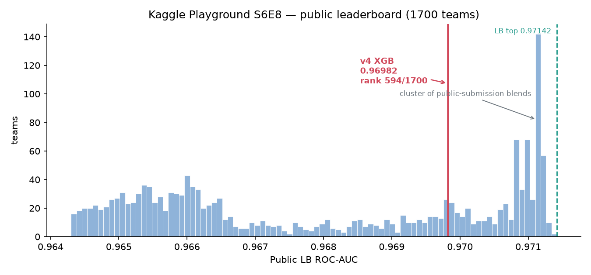

# Kaggle Playground S6E8 — Predicting Smartphone Addiction

Second worked example for `databricks-ai-intern`, and the reference layout for
`examples/` (see [`../README.md`](../README.md)).

> **Competition:** [playground-series-s6e8](https://www.kaggle.com/competitions/playground-series-s6e8)
> **Task:** binary classification — predict `addicted_label` from 12 smartphone-usage features.
> **Metric:** ROC-AUC. **Closed:** 2026-08-31.

## TL;DR

| | |
|---|---|
| **Public LB** | **0.96982** |
| Rank at that score | ~594 / 1700 teams |
| Naive first attempt | 0.96324 — hand-picked params, raw features |
| LB top | 0.97142 (best score reachable from *published* work: 0.97117) |
| OOF → LB offset | **+0.00139** and **+0.00129** measured, against +0.00109–0.00150 predicted |
| Compute | **CPU only** — ~10 min for a 5-fold XGBoost over 691k rows |
| Submissions used | 2 of 10/day |

Full numbers, the killed hypotheses, and the honest-ceiling argument are in
[`FINAL_RESULTS.md`](FINAL_RESULTS.md).



## How this example was produced

Honest attribution, because it matters for reading the rest:

- **The modelling ladder was iterated locally** by Claude (this session) — fast and free,
  ~10 min per 5-fold experiment on CPU. `scripts/train.py` + `versions.yaml` are that work.
- **The agent (`databricks-ai-intern`) was run end-to-end on Databricks** against the same
  staged data, from `scripts/agent-prompt.txt`. That run is what
  [`logs/`](logs/) records.
- The leaderboard score above is from the locally-iterated pipeline. Where the agent's
  own run landed is recorded separately in `FINAL_RESULTS.md` rather than merged into the
  headline number.

## What running the agent actually exposed

This is the part worth reading. Pointing the agent at a real competition surfaced **five
defects that the 499-test unit suite passed straight over**, four of them pre-existing.

| # | Defect | How it showed up | Status |
|---|---|---|---|
| 1 | **Six tools handed the model the string `"formatted"`** | `read_skill`, `critic`, `experiment`, `sweep`, `research_loop`, `model_serving` return a `ToolResult` dict, not `(str, bool)`. Python unpacks a two-key dict into its *keys*, so the tool's entire output was the 9-character string `"formatted"`, with `"isError"` — truthy — as the success flag. Nothing errored. | **Pre-existing.** Fixed centrally in the router. |
| 2 | **A length-truncated reply silently ended the turn** | The model spent 79s composing a training script, hit its output-token ceiling before emitting any tool call, and the loop reported `turn_complete` with the work discarded. The guard was `if finish_reason == "length" and tool_calls_acc:` — it only covered a response cut off *mid* tool call. | **Pre-existing.** Guard now fires either way. |
| 3 | **No way to submit a locally-authored script** | Told to build the script incrementally (to dodge #2), the agent wrote it to `/tmp` in seven `bash` heredoc chunks, verified it parsed — then had no way to hand a local file to `databricks_jobs`. It submitted `script: "PLACEHOLDER"`, which staged cleanly, started a serverless job, and burned cluster time on a stub. | **Pre-existing gap.** Added `script_path`, plus a guard that refuses stub bodies. |
| 4 | **`uc_inspect_dataset` dies without `DATABRICKS_WAREHOUSE_ID`** | `RuntimeError: DATABRICKS_WAREHOUSE_ID not set` on the agent's first two calls. It self-recovered — `tool_search` → `uc_volume` → read the CSVs directly — but burned two calls and a stack trace to get there. | Environment gap; set the var (see Reproducing). |
| 5 | **Deferred tool loading gutted the research sub-agent** | My own change. `research_tool` filtered `get_tool_specs_for_llm()`, which no longer returns deferred tools, so the researcher silently dropped from 9 read-only tools to 2. | **Mine.** Fixed with `get_tool_specs_by_name`. |

Defect #1 is the one to sit with. The skills system never worked at the agent boundary:
every `read_skill` call returned nine characters instead of a playbook. The s6e5 example's
agent never read its own playbook either. It was caught only because the agent, given a
tool that kept returning nine bytes, did the sensible thing and ran
`echo "checking tool output format"` — behaviour no assertion was looking for.

### How the agent debugged its own failed job

Worth recording as a sequence, because the shape of it is the point:

| Step | Job | Outcome | What it learned |
|---|---|---|---|
| 1 | full `s6e8_train.py`, 533 lines | FAILED (INTERNAL_ERROR, 3.8 min) | something in the pipeline breaks at scale |
| 2 | `databricks_jobs logs` + `inspect` | — | run output gave no usable traceback |
| 3 | `s6e8_import_test.py` | SUCCESS | every dependency is present, so it is not a missing package |
| 4 | `s6e8_mlflow_probe.py` | — | isolated the fault to the MLflow path specifically |
| 5 | `s6e8_train.py`, 20k rows / 100 trees | SUCCESS in 87s | the *whole* pipeline works — features, 3 models, stack, MLflow registration, submission write and verify |
| 6 | `s6e8_train.py`, full 691k rows, real params | (submitted) | scale up only once the shape is proven |

Shrink the problem until it passes, then scale. It never re-ran the same script unchanged
after a failure, and it never guessed at a dependency it had not tested. The `script_path`
feature added above is what made steps 3–6 possible at all: each probe is a small local
file, not a script re-emitted through the model.

### What went right

- **`compute_advice` was consulted before compute was chosen**, and returned CPU with a
  reason — which is the whole point of adding it.
- **`tool_search` worked as designed in the live loop**: the model read `uc_model` from
  the deferred catalog, called `tool_search` with `select:uc_model`, then invoked it.
- **Incremental script authoring worked** once instructed: seven heredoc chunks, then a
  `grep` for `dbutils` and an `ast.parse` check before submitting.
- **Self-recovery on #4** was clean — diagnose, switch tool, proceed. No blind retry.

## Modelling, in one paragraph

CV is `StratifiedKFold(5, shuffle=True, random_state=42)` on original row order — there
is no temporal or group column here, so s6e5's "time-holdout is the only valid proxy"
lesson explicitly does not transfer. Of the ~0.005 between the naive attempt and a
competent model, the ablation attributes **~+0.0042 to features and ~+0.0008 to
hyperparameters** — and the feature that carried it was nested target encoding plus
frequency encoding over all 12 columns cast to string levels, numerics included, worth
+0.0032 on its own. Missingness is MCAR, so NaN indicators are worthless (measured
−0.00001). Three ideas that sounded good — Monte-Carlo marginalisation over missing
values, constrained `daily`↔`weekend` imputation, and mixing in the original 7,500-row
source dataset — all lost, and `FINAL_RESULTS.md` records by how much, including the
mid-session conclusion of mine that the ablation later overturned.

## Files

```
kaggle-smartphone-addiction-s6e8/
├── README.md                    # this file
├── FINAL_RESULTS.md             # every attempt ranked, lessons locked
├── versions.yaml                # the attempt ledger + a `rejected:` block
├── scripts/
│   ├── agent-prompt.txt         # prompt handed to the agent
│   ├── train.py                 # one parameterized trainer, driven by versions.yaml
│   └── kaggle_submit.py         # validate, submit, poll for the LB score
├── artifacts/
│   ├── submission.csv           # the scored submission
│   ├── leaderboard-snapshot.csv # full public LB, 1700 teams
│   └── leaderboard-position.png
└── logs/agent-transcript.log    # the agent's Databricks run
```

## Reproducing

```bash
# 1. Data — bearer token from Kaggle → Settings → API
mkdir -p /tmp/s6e8 && cd /tmp/s6e8
TK=$(tr -d '\n' < ~/.kaggle/access_token)
for f in train.csv test.csv sample_submission.csv; do
  curl -sL -H "Authorization: Bearer $TK" -o "$f" \
    "https://www.kaggle.com/api/v1/competitions/data/download/playground-series-s6e8/$f"
done

# 2. Local ladder
cd examples/kaggle-smartphone-addiction-s6e8/scripts
python train.py --version v4_xgb_full_fe --data-dir /tmp/s6e8 --out-dir /tmp/s6e8work

# 3. Submit (row count and id order are validated before a submission is spent)
python kaggle_submit.py --file /tmp/s6e8work/submission_v4_xgb_full_fe.csv \
  --message "v4 xgb full-FE"
```

To reproduce the agent run, stage the CSVs into a UC Volume and launch headless. Set
`DATABRICKS_WAREHOUSE_ID` or `uc_inspect_dataset` will fail (defect #4):

```bash
databricks fs mkdir dbfs:/Volumes/<cat>/<schema>/<vol>/s6e8
for f in train.csv test.csv sample_submission.csv; do
  databricks fs cp /tmp/s6e8/$f dbfs:/Volumes/<cat>/<schema>/<vol>/s6e8/$f --overwrite
done

export DATABRICKS_CONFIG_PROFILE=<profile>
export DATABRICKS_WAREHOUSE_ID=<warehouse id>   # `databricks warehouses list`
databricks-ai-intern --max-iterations 150 "$(cat scripts/agent-prompt.txt)"
```

## Cleanup

```bash
databricks fs rm -r dbfs:/Volumes/<cat>/<schema>/<vol>/s6e8/
databricks unity-catalog models delete <cat>.<schema>.s6e8_addiction_clf
```
